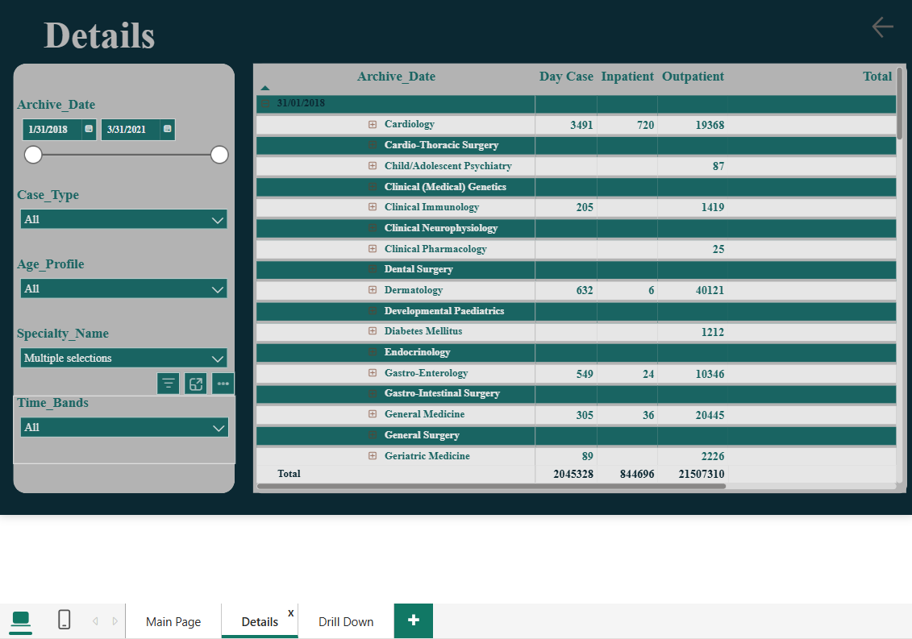
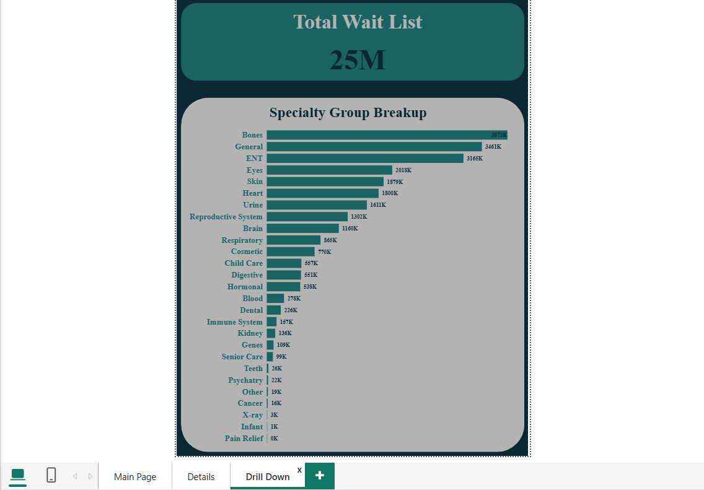

# Healthcare Data Analysis Dashboard (Power BI)

This project presents an interactive healthcare dashboard built using Power BI.

## Tools Used
- Power BI
- Power Query

## Project Overview
- Cleaned and transformed inpatient and outpatient datasets
- Built interactive healthcare dashboard
- Analyzed specialty distribution and workload trends

## Screenshots

